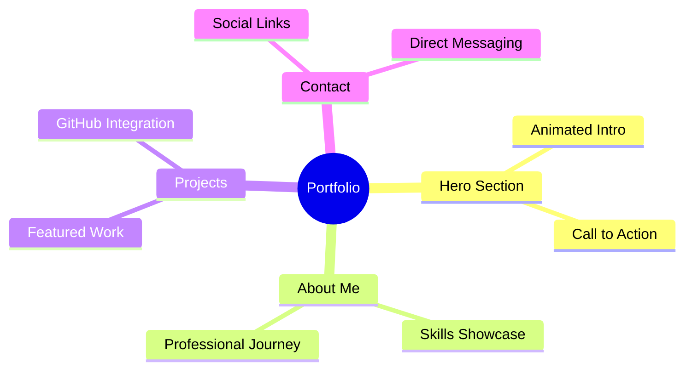

<div align="center">

# 🚀 Salim Portfolio

### *Where Code Meets Creativity*


[](https://zalim-388.github.io/portfolio_/)
[](https://flutter.dev)


</div>

---

## ⚡ Quick Stats

<div align="center">


</div>

---

## 🛠️ Tech Arsenal

<div align="center">

<table>
<tr>
<td align="center" width="96">

<br>Flutter
</td>
<td align="center" width="96">

<br>Dart
</td>
<td align="center" width="96">

<br>HTML5
</td>
<td align="center" width="96">

<br>CSS3
</td>
<td align="center" width="96">

<br>GitHub
</td>
</tr>
</table>

</div>

---

## 🌟 What's Inside



---

## 🚀 Features That Shine

<table>
<tr>
<td>

### 🎭 **Animations**
- Wave hand gesture
- Floating elements
- Gradient text effects
- Smooth transitions

</td>
<td>

### 📱 **Responsive**
- Mobile-first design
- Tablet optimization
- Desktop perfection
- Cross-browser support

</td>
</tr>
<tr>
<td>

### ⚡ **Performance**
- 98+ Lighthouse score
- Fast loading times
- Optimized assets
- PWA ready

</td>
<td>

### 🎨 **Design**
- Modern UI/UX
- Dark theme
- Glass morphism
- Micro-interactions

</td>
</tr>
</table>

---

## 🔥 Installation & Setup

<details>
<summary><b>📋 Prerequisites</b></summary>

- Flutter SDK (3.0+)
- Dart SDK (3.0+)
- Web Browser
- Git

</details>

<details>
<summary><b>⚡ Quick Start</b></summary>

```bash
# Clone repository
git clone https://github.com/zalim-388/portfolio_.git

# Navigate to project
cd portfolio_

# Get dependencies
flutter pub get

# Run in development
flutter run -d chrome

# Build for production
flutter build web --release
```

</details>

<details>
<summary><b>🌐 Deployment</b></summary>

```bash
# Deploy to GitHub Pages
flutter build web --release
# Push to gh-pages branch (automated via GitHub Actions)
```

</details>

---

## 📊 Project Structure

```
📁 portfolio_/
├── 📱 lib/
│   ├── 🚪 main.dart
│   ├── 📄 screens/
│   │   ├── homepage.dart
│   │   ├── aboutme.dart
│   │   ├── projectscreen.dart
│   │   └── contactscreen.dart
│   ├── 🧩 widgets/
│   │   ├── appcolor.dart
│   │   ├── socialicon.dart
│   │   └── responsive.dart
│   └── 🔧 utils/
├── 🌐 web/
├── 📋 pubspec.yaml
└── 📖 README.md
```

---

## 🤝 Connect & Collaborate

<div align="center">

### *Let's build something amazing together!*

<br>

<a href="https://github.com/zalim-388">

</a>
<a href="https://www.linkedin.com/in/salim-a31335351/">

</a>
<a href="https://www.instagram.com/zaliiim__">

</a>
<a href="https://x.com/zaalim388">

</a>

<br><br>

📧 **zaalim388@gmail.com**

</div>

---

## 📈 GitHub Analytics

<div align="center">


</div>

---

## ⭐ Show Your Support

If this project helped or inspired you, please consider:

<div align="center">

[](https://github.com/zalim-388/portfolio_)
[](https://github.com/zalim-388/portfolio_/fork)

</div>

---

## 📜 License

<div align="center">

This project is licensed under the **MIT License** - see the [LICENSE](LICENSE) file for details.

<br>

*Built with 💙 by **Salim** • Made in India 🇮🇳*

<br>


</div>
